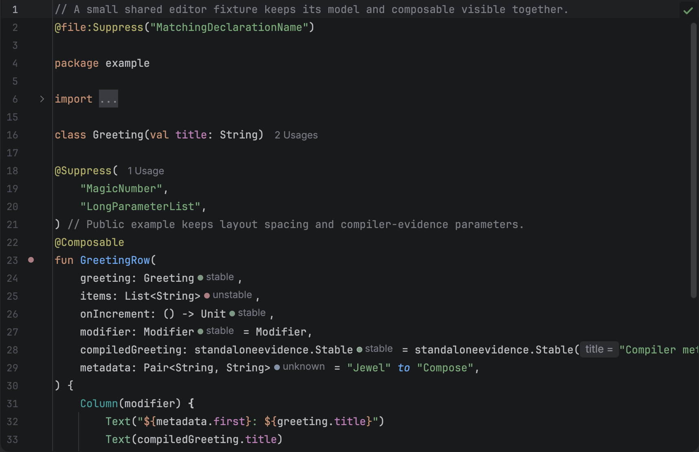
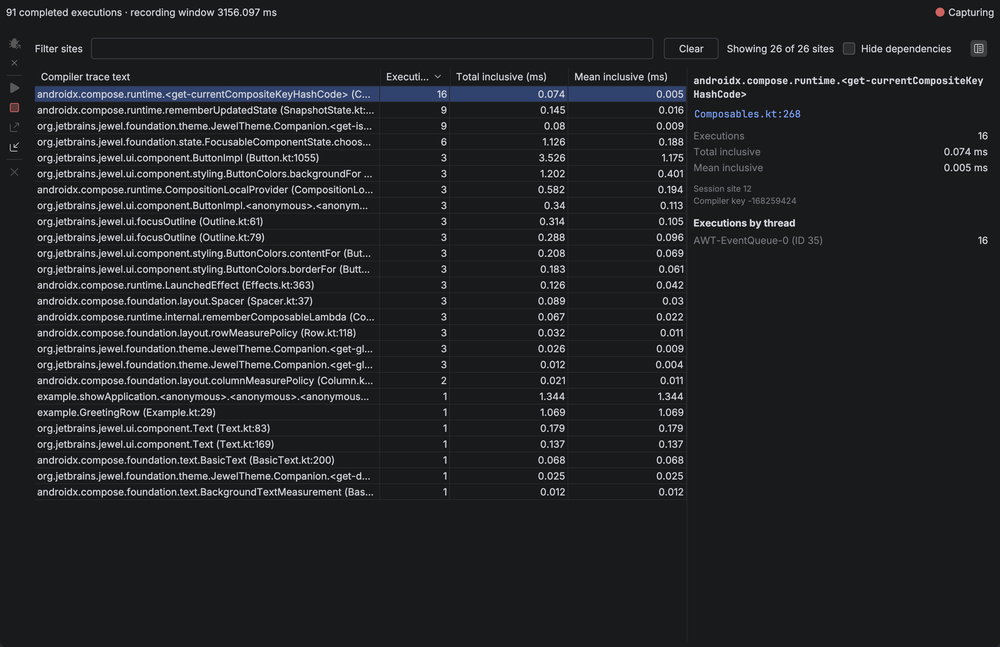

# Jewel Tooling

Jewel Tooling is an IntelliJ IDEA plugin for Compose UI authors. It shows a stability estimate beside each `@Composable` parameter, and it can record live composition activity from a local development run.

You do not add a dependency, change application source, or start a server for the editor hints. Live inspection launches a temporary copy of a run configuration you already have.

This is the 0.9.0 distribution for IntelliJ IDEA 2026.2. Install it from JetBrains Marketplace when the listing is live, or from the ZIP built in this repository.

## What it looks like



Hints appear after parameter types in project files and in attached dependency Kotlin sources. Hover for a short explanation. Click the function gutter icon for every input, or use **Inspect Compose Stability**.



**Run with Compose Inspection** connects to your selected configuration and fills the **Live recompositions** tab as you use the UI. Inclusive duration badges appear at the end of matching function or property lines. Those times include nested calls and capture overhead. They are not frame times, and they do not prove a skip.

## Try it

Build with JDK 25, then install `build/distributions/jewel-tooling-0.9.0.zip` from JetBrains Marketplace or through **Settings → Plugins → gear → Install Plugin from Disk**.

```sh
./gradlew :buildPlugin
```

To use an existing compatible IDE distribution instead of downloading one:

```sh
./gradlew -PlocalIdePath=/path/to/IntelliJIDEA.app/Contents :buildPlugin
```

Open a project, allow indexing to finish, then open a Kotlin file with `@Composable` functions. Toggle inline hints under **Settings → Editor → Inlay Hints → Kotlin → Compose parameter stability**. Change colours under **Settings → Editor → Color Scheme → Jewel Tooling**.

The [user guide](user-guide/README.md) covers install, editor hints, live inspection, recordings, customisation, and coding-agent setup. The [changelog](CHANGELOG.md) lists this release.

To use the same static analysis from a coding agent, open **Tools → Compose Analysis MCP Server…**. Enable access, select your client, and click **Install**. See the [MCP setup guide](user-guide/agents/mcp.md).

## Limits in one place

These are conservative static estimates, not compiler reports. Stability alone does not determine skipping. Strong skipping can skip unstable parameters when the relevant object identities are unchanged. Do not add `@Stable` just to turn a hint green.

Live capture observes Compose trace callbacks on the composition thread. It does not identify skips, invalidation causes, argument values, or composition instances. An empty view does not prove that the application is idle.

The plugin targets IntelliJ IDEA 2026.2.0.1 (build 262.8665.337) with the bundled Kotlin plugin in K2 mode. There is no upper IDE build limit. Only that build has been validated.

## Contribute

Start with [Contributing](CONTRIBUTING.md). Architecture, testing, conventions, and static analysis live under [docs/](docs/architecture.md).

Inspired by [Skydoves Compose Stability Analyzer](https://github.com/skydoves/compose-stability-analyzer). Jewel Tooling is an original implementation; no CSA source code was copied.

Licensed under [Apache 2.0](LICENSE).
