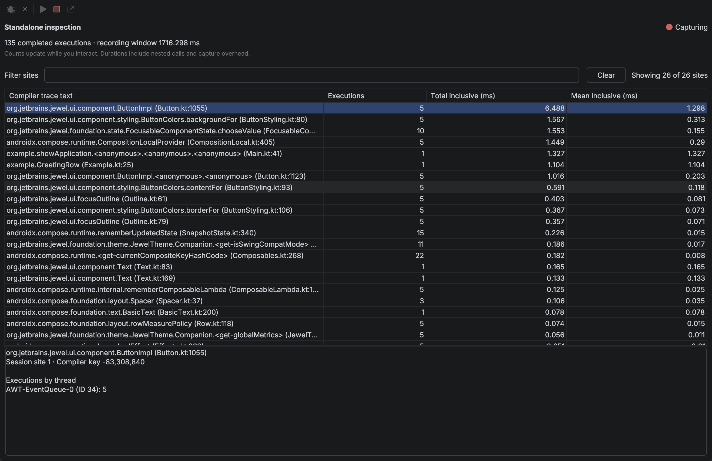
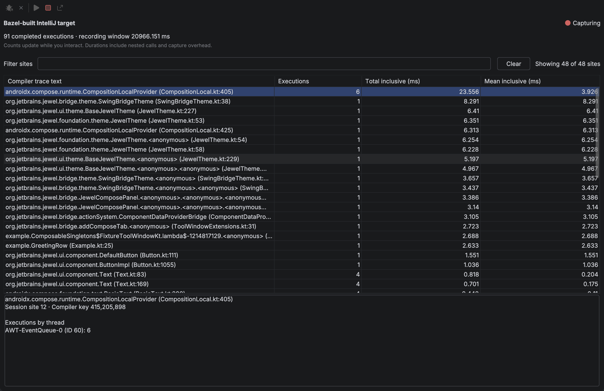
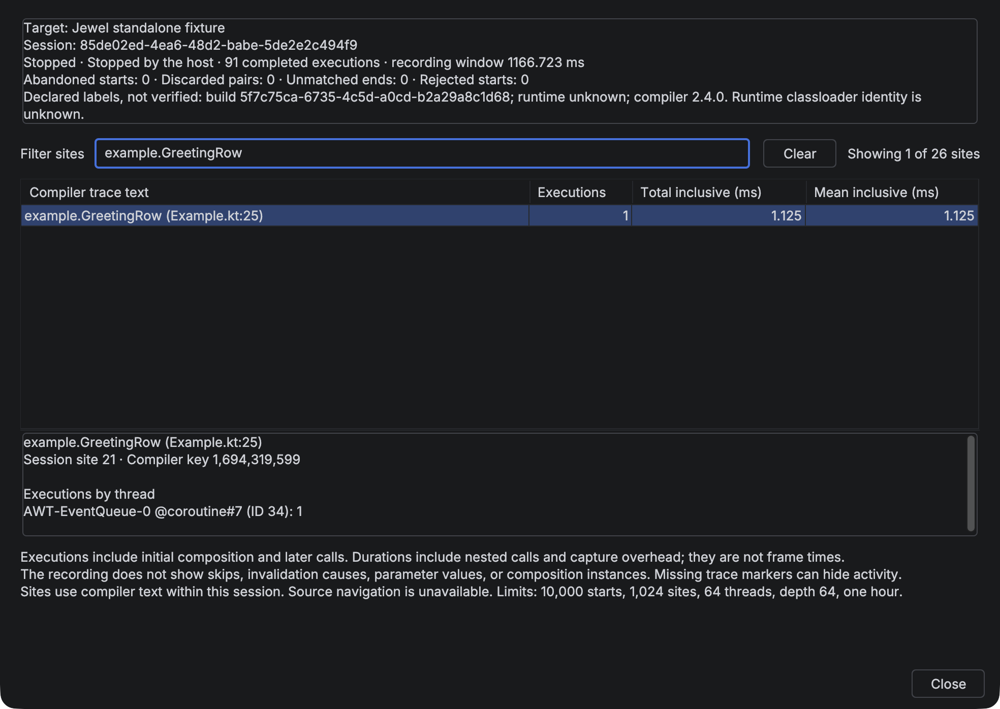
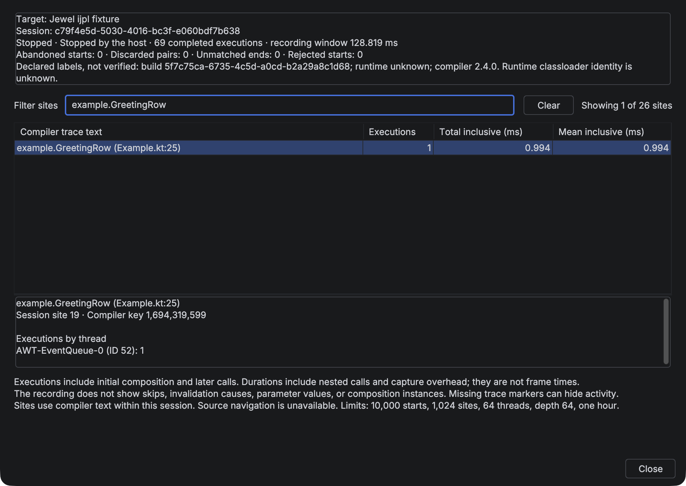

# Jewel Tooling user guide

Jewel Tooling shows a static stability estimate beside each parameter of a Kotlin `@Composable` function. Hover over a hint to see its reason, or click the function’s gutter indicator to inspect all its inputs. It helps you inspect Jewel and Compose APIs without running the application or changing its source.

## Install the plugin

Build with JDK 21 using `./gradlew :buildPlugin`. In IntelliJ IDEA, open **Settings → Plugins**, choose the gear menu, then **Install Plugin from Disk**. Select `build/distributions/jewel-tooling-0.4.0.zip` and restart when prompted.

The build targets IntelliJ IDEA 2026.2.0.1 with its bundled Kotlin plugin. This IDE uses K2. There is no upper IDE build limit, so newer IDEs can install the plugin. Only build 262.8665.337 has been validated; newer IDE and Android Studio builds may need API compatibility fixes.

## Run your project with live inspection

Open your project in IntelliJ IDEA and select the run configuration you normally use to start its Compose UI.
The target must use a local JVM of version 21 or newer.

1. Choose **Run with Compose Inspection** from the run widget (beside Run and Debug), the configuration gutter, or **Run → Run with Compose Inspection**. The default shortcut is Ctrl+Alt+Shift+F10, or Ctrl+Option+Shift+R on macOS.
2. The plugin launches a temporary copy of that configuration, connects to its target, and starts capture when Compose loads.
3. Use your application. Execution counts update in the **Compose Inspection** tool window while the application runs.
4. Click **Stop Capture**, then **Export Recording** to save the result.

The plugin installs bundled inspection support when needed. **Tools → Install Inspection Support** can prepare the agent without launching.
You do not need to add a dependency, change application source, or copy a connection token.

The launch uses a temporary copy of your configuration. Its existing build steps run before the application starts.
Your saved configuration stays unchanged. A normal **Run** starts your application without the inspection agent.

### Jewel Standalone and Gradle

Select a Gradle run configuration with one explicit application task, such as `:desktop:run`.
Use the full task path when different modules have tasks with the same name.
The task must be a `JavaExec` task. A task that only delegates to another task is not sufficient.
Included Gradle plugin builds that run while the project configures are ignored until that application task is in the task graph.

The plugin adds the agent to that application's JVM. It does not add it to the Gradle daemon.
The temporary launch disables Gradle's configuration cache. Your project's configuration stays unchanged.
Remote targets, compound configurations, and `runIde` split mode are not supported.

### IntelliJ Platform and Bazel

Open the project's supported IntelliJ model and select its local **Application** or **Kotlin** run configuration.
Keep the normal Bazel build step in that configuration, if the project requires one.
Then choose **Run with Compose Inspection**.

The selected configuration must start the target IDE in a separate JVM.
Open the plugin UI in that target IDE and interact with it to produce trace events.
The **Compose Inspection** tool window in the authoring IDE receives those events.
JBR 25 is supported by the agent's bytecode reader.

The plugin does not convert an arbitrary Bazel command into an IDE launch configuration.
Use the project's existing configuration that already starts its development IDE.

### Read and control the live capture

The tool window shows the target, capture state, completed execution count, and recording window.
Select a trace site to inspect its details. Filter the table to focus on one composable.
The recording window is elapsed capture time. Inclusive durations also contain nested calls.

**Waiting for Compose** means that the connection exists but the target has not loaded its Compose runtime yet.
Open a Compose surface in the target. Capture starts automatically when a supported runtime becomes available.
An unsupported runtime or multiple runtime copies stop capture with an explanation.
The agent captures trace callbacks on the Swing event dispatch thread.

**Stop Capture** stops recording and leaves your application running.
**Disconnect Target** closes inspection and also leaves the application running.
Run with inspection again to create another connection after disconnecting.
Use the normal **Stop** control in the Run tool window to stop the application itself.

Starting another capture asks before discarding a nonempty, unexported result.
A confirmed final result remains exportable after disconnecting.
Disconnecting during capture leaves an incomplete snapshot, which cannot be exported as a final recording.

The live view does not identify initial composition, skipped calls, invalidation causes, or composition instances.
Missing compiler trace markers can hide activity. An empty live view does not prove that the application is idle.

The screenshots below show live captures started through **Run with Compose Inspection**.





## Open a project

For Jewel Standalone, import the Gradle project and let synchronization and indexing finish. The IDE must resolve Compose annotations and the parameter types.

For Bazel projects, use the project's supported IntelliJ project model. Bazel build files alone do not define the IDE's source roots, classpaths, or Kotlin compiler options. The model should include the Compose compiler plugin used by the build, especially for libraries using Kotlin 2.4 composable function types. Jewel Tooling uses those resolved roots and dependencies; it does not run Bazel or parse build output during editing.

The Bazel E2E boundary is a model exported from a real Bazel build. It does not test a third-party Bazel importer wizard. Kotlin Multiplatform source-set models are untested in v1. Unannotated types in another source module remain unknown. Supported compiled dependencies can use compiler metadata.


The Gradle fixture uses released Jewel and Compose dependencies. The hints appear after the parameter types.


The Bazel fixture exports its real compile classpath into an IDE module. Both project models use the same hint provider.

## Read a hint

| Hint | Meaning |
| --- | --- |
| stable | A recognized stable type, a trusted Compose stability contract, an inferred final source class whose stored properties have stable types, or supported compiler metadata with stable selected type arguments. |
| unstable | A standard collection or array, a vararg, a class with a mutable or unstable stored property, or a supported compiler metadata result that proves instability. |
| unknown | The type is unresolved, outside the supported inference rules, or too expensive to analyze within the fixed budget. |

The explanation tells you which rule produced the estimate. `@Stable` and `@Immutable` are contracts: the plugin trusts them and does not prove that their promises are valid. Do not add either annotation only to change a hint.

These hints are not Compose compiler reports. A stability estimate alone does not say whether a function will recompose. With strong skipping, an unstable parameter can still permit skipping when its relevant identity has not changed.


Each hint has a small circle and a text label. Green means stable, muted red means unstable, and blue-grey means unknown.

A plain circle means that the result uses inference, a built-in rule, or a declared contract.
A circle with a 1-point border means that supported compiler metadata confirms the type's stability.
Mixed evidence stays borderless. For example, a source class does not gain a border because one property has compiler metadata.
The border does not say whether a composable can be skipped.

To change the colours, open **Settings → Editor → Color Scheme → Jewel Tooling**.
Each state has separate fill and border colours. The defaults adapt to light and dark editor schemes.
The text uses the IDE's standard inlay text colour. Unknown results currently stay borderless.

Hover over a hint for its type, status, evidence, and reason. The longer explanation of stability and skipping is in the function detail view.

## Inspect a function

Click the gutter indicator beside a composable function to open **Compose stability**. The popup shows the function name, status counts, and each input’s source type, explanation, and evidence. Evidence labels distinguish built-in rules, declared contracts, source inference, and compiler metadata. A generic type can combine several kinds of evidence. Green circles identify stable inputs, muted red circles identify unstable inputs, and blue-grey circles identify unknown inputs. Text accompanies every status. These are input estimates, not a verdict that the function is skippable.


To open the same view from the keyboard, place the caret inside the function, open **Find Action**, and choose **Inspect Compose Stability**. The action is also in the editor context menu. You can select and copy explanation text, scroll through longer parameter lists, and resize the popup. Press **Escape** to return to the editor. Editing the source or switching editors closes the popup so it cannot keep showing an outdated result.

Choose **Go to declaration** when an explanation offers it. The editor opens the responsible property or the inferred stable class.
Nested explanations can lead to a property inside another source class. Targets come from resolved declarations in the same IDE module.
The link is available by keyboard and includes the parameter name for screen readers.

Navigation stops if indexing starts or any project source changes after the analysis. Close and reopen the details to refresh the targets.
A missing link means that the explanation has no supported source target. Compiler text and binary metadata do not become guessed source links.


Counts include value parameters and an extension receiver, when present. Context parameters are not analyzed. Functions with no covered inputs show that explicitly. An unstable input takes precedence in the gutter icon; otherwise an unknown input takes precedence over stable inputs.

## Read compiler evidence

For a resolved binary dependency, the plugin can read the class’s existing Compose stability metadata. It reads the class file without loading or executing it. You do not need to add a plugin or dependency to the project being inspected.

The reader accepts Kotlin metadata `[2, 3, 0]` and `[2, 4, 0]` in Java 8–25 class files. It rejects preview class files.

The tests compile real dependencies with these configurations:

| Kotlin and Compose compiler | JVM target | Purpose |
| --- | --- | --- |
| 2.3.20 | 25 | Jewel Standalone compiler configuration |
| 2.4.20-RC3 | 25 | IntelliJ Platform compiler configuration |
| 2.4.0 | 21 | Previous supported configuration |

These versions describe the compiled dependencies, not the IDE runtime. Running on JBR 25 does not require every dependency to target Java 25.
The plugin keeps its Java 21 bytecode target. Source analysis does not depend on the binary metadata reader.

A metadata version does not identify the compiler patch version. Computed stability initializers and other unsupported shapes stay **unknown**.
Other metadata versions and class files newer than Java 25 also stay **unknown**. This does not provide general coverage of published Jewel or Compose libraries.

For generic classes, the metadata identifies which type arguments matter. For example, a compiled `Box<T>(val value: T)` combines the compiler’s class result with the analysis of `T`. A star projection stays unknown when that argument is required. An unused type argument does not affect the result. The details view labels compiler and source evidence separately when both contribute.

These class results do not establish whether a function is restartable or skippable. Stability configuration files are not read. A dependency without supported metadata can still be stable through a recognized `@Stable` or `@Immutable` contract.

## Change hint visibility

Open **Settings → Editor → Inlay Hints** and find **Compose parameter stability** under Kotlin. Turn the provider off to hide its hints; turn it on to restore them. The setting does not modify your source or build. Gutter indicators have a separate switch under **Settings → Editor → General → Gutter Icons → Compose stability summary**. The detail action remains available when indicators are hidden.

## Understand the limits

The provider covers value parameters and extension receivers; it does not show context-parameter hints. Explicit `FunctionN` class references can remain unknown even when function syntax such as `() -> Unit` is stable.

The plugin does not interpret external stability configuration files or custom and inherited stability contracts. It leaves unannotated library types such as `Pair` and `Triple` unknown. Singleton objects and value classes, including unsigned types, are also unknown unless a recognized contract applies.

Generic substitution handles concrete stored types. Repeated instantiations of the same class, such as `Box<Box<String>>`, conservatively stop at the recursion guard. Recursive types remain unknown. Inner and local classes also remain unknown because they can capture state outside their declared properties. Computed properties without backing fields and companion state do not count as instance storage; delegated storage is unknown.

Analysis processes the extension receiver, then parameters in declaration order. It stops after 256 type visits for a function or a nesting depth of 12. Earlier completed hints remain; exhausted assessments say unknown and explain the budget limit. Binary reads also stop at 1 MiB per class, 4 MiB per function, or 32 distinct class files. No result is retained across editing passes.

## Troubleshoot missing hints

Wait for indexing and Gradle synchronization to finish. Check that `androidx.compose.runtime.Composable` resolves in the editor and that the function has explicit parameter types. An unrelated annotation named `Composable` does not activate the provider.

Check the inlay setting and the IDE baseline. An unknown result is useful evidence of an unsupported case; it is not a claim that the type is unstable. Include a small public reproduction when reporting a result you believe is wrong.

## Generate a demo recording

The automated demo below creates a saved recording without using the live controls.
Use it to check the repository setup or to try the saved report.

To try the existing recorder, use the repository's Jewel Standalone demo. These commands run an automated graphical test, not your application.
Use JDK 21 or newer and the display permissions described under [Development and screenshots](#development-and-screenshots).
From the `jewel-tooling` repository root, run:

```sh
./gradlew :e2e:driver-plugin:exportFixtureSdk
./gradlew -p fixtures/standalone test
```

The test launches the demo, starts capture, clicks **Add item**, stops capture, and saves `fixtures/standalone/build/capture/recording.json`.
In your IDE, choose **Tools → Open Compose Recording** and select that file.

For the Bazel/IJPL demo, follow [Run the end-to-end tests](#run-the-end-to-end-tests).
Each IJPL scenario saves `recording.json` in its artifact directory under `e2e/runner/build/artifacts`.

For your own application, use [Run your project with live inspection](#run-your-project-with-live-inspection).
Stop the capture and click **Export Recording** to create a recording file.

## Inspect a recording

Choose **Tools → Open Compose Recording**, or find that action with **Find Action**. Select the file from the demo above, or one exported by your own configured target.

The report shows the target, session, status, recording window, and any incomplete or rejected events. Click a column heading to sort the sites. Select a site to see its full compiler text and executions by thread. You can select and copy the text. Press **Escape** to close the report.





Use **Filter sites** to find text in the full compiler trace description. Matching ignores case and treats punctuation and spaces literally.
For example, enter `example.GreetingRow` to find that call site. Choose **Clear** to restore all rows.
The result count shows visible sites out of all recorded sites. Filtering does not change session totals or per-site measurements.

An execution is a completed pair of Compose trace callbacks. It can be an initial composition or a later call. The callback does not identify which occurred. Total and mean durations include nested calls and capture overhead. They are not frame times.

A site combines the compiler key and its exact text within one session. Matching function names do not prove matching composition instances. Source navigation stays disabled because the recording contains no verified source map.

The report does not show skips, invalidation causes, parameter values, or composition instances. Missing or disabled trace markers can hide activity. An empty recording does not prove that the target did no work.

## Integrate the experimental recorder

This section describes the older manual adapter for contributors who control a target bootstrap.
It is not required for static hints or **Run with Compose Inspection**. Do not combine it with the inspection agent.

The bootstrap must own the Compose tracer slot before the target starts its Compose content. Compose provides a setter without a getter. The adapter cannot detect or restore another tracer. Do not install it from an ordinary IDE plugin.

In a controlled standalone application, include the exported `recording.jar` and `recording-compose.jar` from `fixtures/standalone/.local`. Supply Jackson Core 2.19.0. Reuse the application's Compose runtime. The adapter targets the AndroidX runtime 1.11.1 API and requires JVM 21 or newer.

For IJPL, keep the bootstrap in a disposable target that explicitly reserves the tracer slot. The fixture uses the platform's Compose and Jackson libraries. It does not package another runtime. Activity from other compositions in that runtime classloader can also appear.

Install one `OwnedCompositionTracer` with `installOwnedDispatcher()`. Call `startRecording(CaptureTarget(...))` and `stopRecording()` between controlled interactions on the composition thread. Serialize the returned snapshot with `RecordingFiles.writeNew(path, recording)` on a worker thread. The method refuses to overwrite an existing file. The [standalone fixture](../fixtures/standalone/src/main/kotlin/example/FixtureRecording.kt) shows this sequence.

For live controls, give the existing dispatcher to a `LiveCompositionHost` before showing the development UI:

```kotlin
val dispatcher = OwnedCompositionTracer.installOwnedDispatcher()
val inspection = LiveCompositionHost(
  dispatcher,
  CaptureTarget("My development application"),
  SwingUtilities::invokeLater,
)
```

This example requires the corresponding recording imports and `javax.swing.SwingUtilities`.
It assumes that all captured composition work uses the Swing event dispatch thread.
Expose `inspection.connectionString` through an explicit copy control. Do not display or log the token.
Call `inspection.close()` when the development target closes.
The host owns the recording sink while open; do not call the dispatcher's recording methods concurrently.
Closing the host leaves the dispatcher installed and inactive. It does not restore another tracer.

Only one session can be attached at a time. Stop it before starting another, including after truncation. General concurrent restart is unsupported because the callback API has no session token.

## Understand recording limits

A session accepts at most 10,000 starts, 1,024 sites, 64 threads, and a nesting depth of 64. Compiler text is limited to 1 KiB per site. Files are limited to 8 MiB, and the recording window is limited to one hour.

Reaching a limit ends capture and marks the result **Truncated**. The recorder discards unfinished root segments and reports their counts. Later activity is unrecorded; its extent is unknown. Clock failures produce **Failed** recordings. The report preserves completed events from before the failure.

Target, compiler, runtime, and build labels are declarations. They do not prove a build identity. Runtime classloader identity remains unknown. Sessions are not merged.

The importer rejects malformed, incomplete, oversized, and unsupported files. It treats compiler text as plain text, never as paths or commands. Saved files stay local. Live inspection uses an authenticated loopback connection to the configured development target.
Automatic launches use a startup agent to observe Compose trace callbacks. The manual adapter uses the Compose tracer slot instead.
The plugin does not connect to remote hosts.

## Development and screenshots

Unit and IDE fixture tests run with `./gradlew :test :recording:test :recording-compose:test`. That task builds a small dependency with the pinned Compose compiler and loads its JAR into the IDE tests, so metadata tests use real compiler output. The separate IDE Starter runner uses JDK 25. Its test-only plugin inspects real rendered inlays and uses Spectre for device-scale captures. The production ZIP contains the plugin, shared recording library, and bundled inspection agent.
The agent keeps its dependencies in a separate classloader. The ZIP excludes Spectre and the Compose runtime.

Documentation captures require an unlocked graphical session, screen-capture permission, and a real AWT device transform of 2.0. On macOS, Spectre captures the target window through its native helper, excluding other applications. The capture harness checks native PNG dimensions and never upscales a 1x image. Public Linux CI exercises headed scenarios under Xvfb and verifies committed screenshot hashes and source provenance; it does not claim to regenerate Retina assets.

## Run the end-to-end tests

The editor tests install the production ZIP and a separate test driver in disposable IDEA instances. IDE Driver and platform actions inspect rendered inlays, edit a property, hover a hint, toggle the provider, click a gutter indicator, and exercise the detail action and Escape dismissal. They also check that an edit dismisses an open detail view. Spectre captures the editor and drives the actual Compose surfaces through their semantics. The production plugin does not depend on the test driver or Spectre.

Both targets import a real recording and check the report. They also test live counts, stop, export, and unload during capture.
The standalone live target runs in a separate JVM. Spectre drives its Compose controls.
The tests reload the plugin and reopen the exported recording.

Two additional scenarios use the production Install and Run controls. They launch a Gradle application and a separate IDE with a Bazel-built plugin.
They verify automatic connection, live events after interaction, stop, disconnect, and unchanged saved configurations.

```sh
./gradlew :e2e:driver-plugin:exportFixtureSdk
python3 scripts/prepare-bazel-fixture.py
./gradlew -p fixtures/standalone test
./gradlew :e2e:runner:test --tests '*JewelTargetsTest*'
```

Install Bazelisk before preparing the Bazel fixture; its version is selected by `fixtures/ijpl/.bazelversion`. The fixture uses a small Kotlin Bazel action and exports `JavaInfo`. The SDK export task also prepares the compiler-produced test dependency used by both editor targets. It does not depend on an IntelliJ source checkout.


Spectre verifies that clicking **Add item** changes the count from one to two.


The IntelliJ fixture runs against the IDE's Compose and Jewel runtime.

To regenerate the thirteen guide images on a Retina display, run:

```sh
./scripts/capture-retina.sh
```

The script builds the fixtures and runs the editor, live-launch, and MCP scenarios for both targets. It promotes only successful captures from that run. It records source hashes and native image dimensions in `docs/images/manifest.json`. Any change to a capture input requires a new capture. Allow up to an hour for the first run with empty dependency caches.

GitHub Actions runs the tests under a Linux virtual display and checks the committed Retina assets. Its screenshots are diagnostic artifacts, not replacements for the guide images. Release tags run validation before publishing the unsigned plugin ZIP and its SHA-256 digest; Marketplace publication and signing are not configured.

## Coding agent access

Open **Tools → Compose Analysis MCP Server…**, enable the server, select a coding client, and click **Install**.
The [MCP guide](agents/mcp.md) covers Android Studio, Antigravity, Codex, Claude Code, Pi, Amp, OpenCode, and GitHub Copilot.
The same setup dialog offers optional agent skill installation and versioned updates. Local edits are preserved.

Pi support uses **pi-mcp-adapter**. If you use another extension, ask your agent to adapt the setup.
