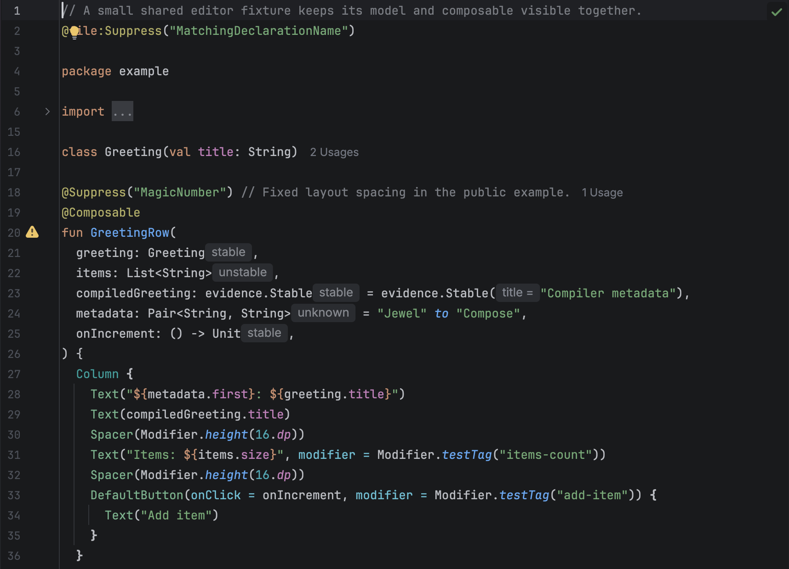
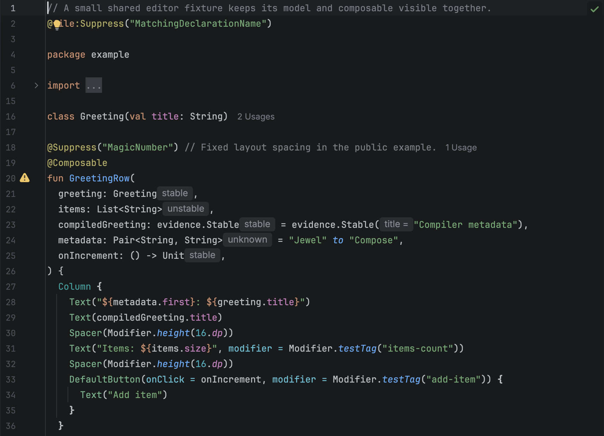
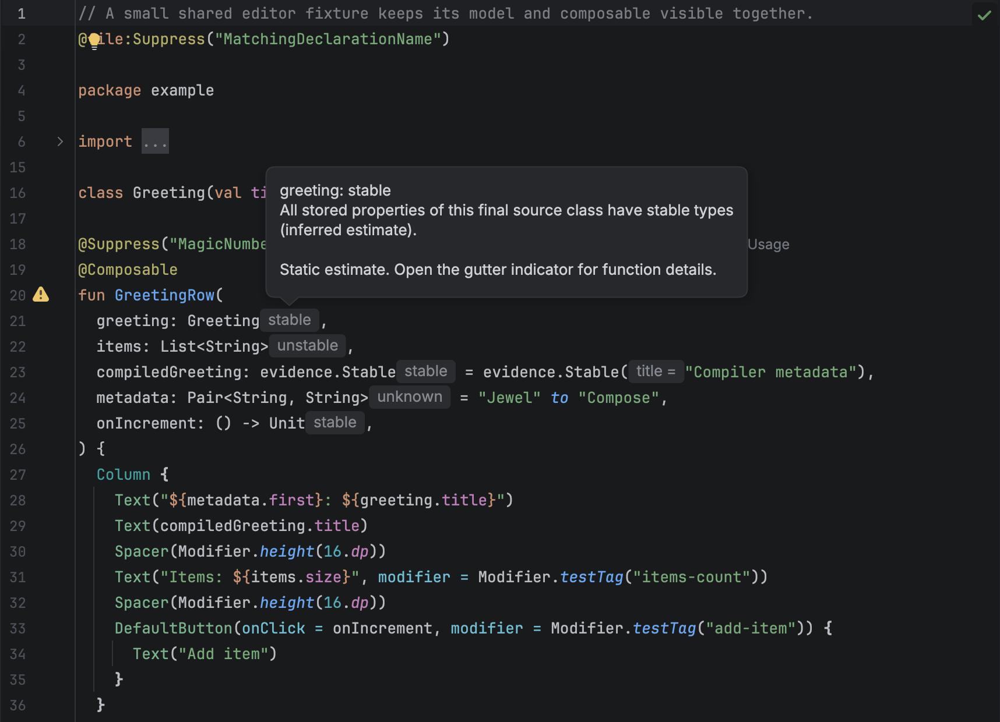
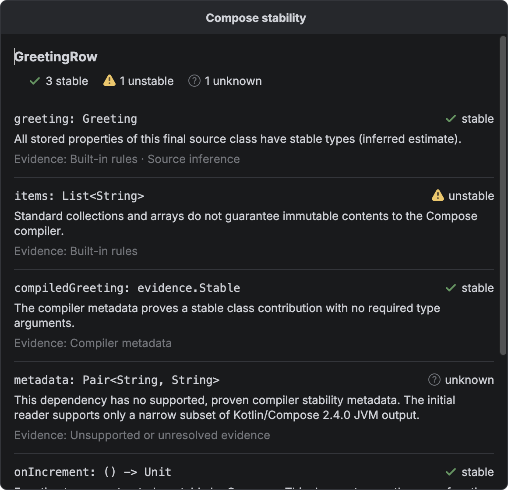
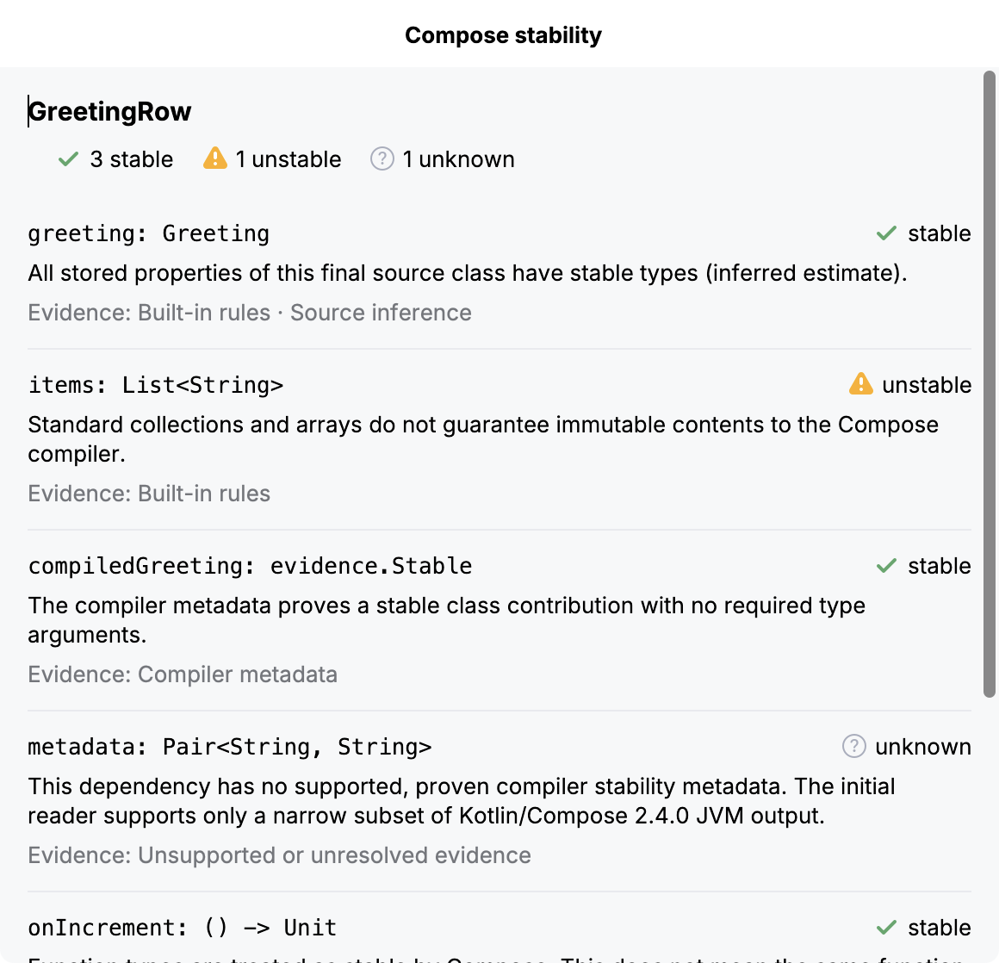
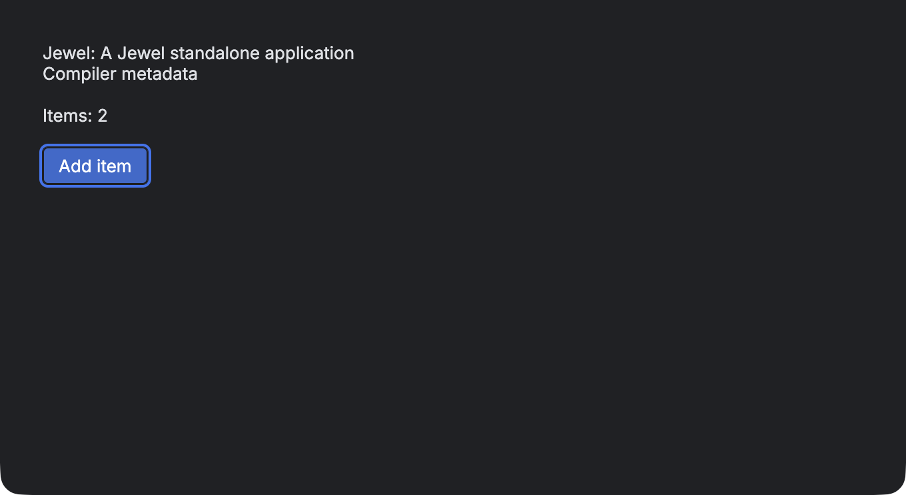
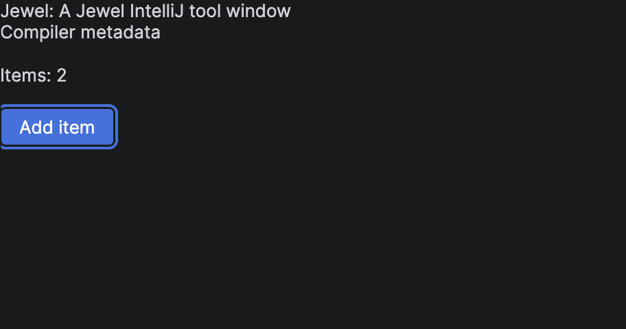

# Jewel Tooling user guide

Jewel Tooling shows a static stability estimate beside each parameter of a Kotlin `@Composable` function. Hover over a hint to see its reason, or click the function’s gutter indicator to inspect all its inputs. It helps you inspect Jewel and Compose APIs without running the application or changing its source.

## Install the plugin

Build with JDK 21 using `./gradlew :buildPlugin`. In IntelliJ IDEA, open **Settings → Plugins**, choose the gear menu, then **Install Plugin from Disk**. Select `build/distributions/jewel-tooling-0.2.0.zip` and restart when prompted.

The build targets IntelliJ IDEA 2026.2.0.1 with its bundled Kotlin plugin. This IDE uses K2. There is no upper IDE build limit, so newer IDEs can install the plugin. Only build 262.8665.337 has been validated; newer IDE and Android Studio builds may need API compatibility fixes.

## Open a project

For Jewel Standalone, import the Gradle project and let synchronization and indexing finish. The IDE must resolve Compose annotations and the parameter types.

For Bazel projects, use the project's supported IntelliJ project model. Bazel build files alone do not define the IDE's source roots, classpaths, or Kotlin compiler options. The model should include the Compose compiler plugin used by the build, especially for libraries using Kotlin 2.4 composable function types. Jewel Tooling uses those resolved roots and dependencies; it does not run Bazel or parse build output during editing.

The Bazel E2E boundary is a model exported from a real Bazel build. It does not test a third-party Bazel importer wizard. Kotlin Multiplatform source-set models are untested in v1. Unannotated types in another source module remain unknown. Supported compiled dependencies can use compiler metadata.



The Gradle fixture uses released Jewel and Compose dependencies. The hints appear after the parameter types.



The Bazel fixture exports its real compile classpath into an IDE module. Both project models use the same hint provider.

## Read a hint

| Hint | Meaning |
| --- | --- |
| stable | A recognized stable type, a trusted Compose stability contract, an inferred final source class whose stored properties have stable types, or supported compiler metadata with stable selected type arguments. |
| unstable | A standard collection or array, a vararg, a class with a mutable or unstable stored property, or a supported compiler metadata result that proves instability. |
| unknown | The type is unresolved, outside the supported inference rules, or too expensive to analyze within the fixed budget. |

The explanation tells you which rule produced the estimate. `@Stable` and `@Immutable` are contracts: the plugin trusts them and does not prove that their promises are valid. Do not add either annotation only to change a hint.

These hints are not Compose compiler reports. A stability estimate alone does not say whether a function will recompose. With strong skipping, an unstable parameter can still permit skipping when its relevant identity has not changed.



Hover over a hint for its status and reason. The longer explanation of stability and skipping is in the function detail view.

## Inspect a function

Click the gutter indicator beside a composable function to open **Compose stability**. The popup shows the function name, status counts, and each input’s source type, explanation, and evidence. Evidence labels distinguish built-in rules, declared contracts, source inference, and compiler metadata. A generic type can combine several kinds of evidence. Green check icons identify stable inputs, warning icons identify unstable inputs, and question icons identify unknown inputs. Text accompanies every status. These are input estimates, not a verdict that the function is skippable.



To open the same view from the keyboard, place the caret inside the function, open **Find Action**, and choose **Inspect Compose Stability**. The action is also in the editor context menu. You can select and copy explanation text, scroll through longer parameter lists, and resize the popup. Press **Escape** to return to the editor. Editing the source or switching editors closes the popup so it cannot keep showing an outdated result.



Counts include value parameters and an extension receiver, when present. Context parameters are not analyzed. Functions with no covered inputs show that explicitly. An unstable input takes precedence in the gutter icon; otherwise an unknown input takes precedence over stable inputs.

## Read compiler evidence

For a resolved binary dependency, the plugin can read the class’s existing Compose stability metadata. It reads the class file without loading or executing it. You do not need to add a plugin or dependency to the project being inspected.

Support is deliberately narrow: the current reader is tested with Kotlin and Compose compiler **2.4.0**, Kotlin metadata `[2, 4, 0]`, and JVM class files up to Java 21. Older compiler metadata, newer class-file versions, computed stability initializers, and other unsupported shapes stay **unknown**. This does not provide general coverage of published Jewel or Compose libraries.

For generic classes, the metadata identifies which type arguments matter. For example, a compiled `Box<T>(val value: T)` combines the compiler’s class result with the analysis of `T`. A star projection stays unknown when that argument is required. An unused type argument does not affect the result. The details view labels compiler and source evidence separately when both contribute.

These class results do not establish whether a function is restartable or skippable. Stability configuration files are not read. A dependency without supported metadata can still be stable through a recognized `@Stable` or `@Immutable` contract.

## Change hint visibility

Open **Settings → Editor → Inlay Hints** and find **Compose parameter stability** under Kotlin. Turn the provider off to hide its hints; turn it on to restore them. The setting does not modify your source or build. Gutter indicators have a separate switch under **Settings → Editor → General → Gutter Icons → Compose stability summary**. The detail action remains available when indicators are hidden.

## Understand the limits

The provider covers value parameters and extension receivers; it does not show context-parameter hints. Explicit `FunctionN` class references can remain unknown even when function syntax such as `() -> Unit` is stable.

The plugin does not interpret external stability configuration files or custom and inherited stability contracts. It leaves unannotated library types such as `Pair` and `Triple` unknown. Singleton objects and value classes, including unsigned types, are also unknown unless a recognized contract applies.

Generic substitution handles concrete stored types. Repeated instantiations of the same class, such as `Box<Box<String>>`, conservatively stop at the recursion guard. Recursive types remain unknown. Inner and local classes also remain unknown because they can capture state outside their declared properties. Computed properties without backing fields and companion state do not count as instance storage; delegated storage is unknown.

Analysis processes the extension receiver, then parameters in declaration order. It stops after 256 type visits for a function or a nesting depth of 12. Earlier completed hints remain; exhausted assessments say unknown and explain the budget limit. Binary reads also stop at 1 MiB per class, 4 MiB per function, or 32 distinct class files. No result is retained across editing passes.

## Troubleshoot missing hints

Wait for indexing and Gradle synchronization to finish. Check that `androidx.compose.runtime.Composable` resolves in the editor and that the function has explicit parameter types. An unrelated annotation named `Composable` does not activate the provider.

Check the inlay setting and the IDE baseline. An unknown result is useful evidence of an unsupported case; it is not a claim that the type is unstable. Include a small public reproduction when reporting a result you believe is wrong.

## Runtime inspection

V1 does not collect recomposition events or open a network port. Dynamic inspection is planned separately, beginning with recorded sessions that can be imported after a run. A live connection is optional.

## Development and screenshots

Unit and IDE fixture tests run with `./gradlew :test`. That task builds a small dependency with the pinned Compose compiler and loads its JAR into the IDE tests, so metadata tests use real compiler output. The separate IDE Starter runner uses JDK 25. Its test-only plugin inspects real rendered inlays and uses Spectre for device-scale captures. No Spectre code is packaged in the production ZIP.

Documentation captures require an unlocked graphical session, screen-capture permission, and a real AWT device transform of 2.0. On macOS, Spectre captures the target window through its native helper, excluding other applications. The capture harness checks native PNG dimensions and never upscales a 1x image. Public Linux CI exercises headed scenarios under Xvfb and verifies committed screenshot hashes and source provenance; it does not claim to regenerate Retina assets.

## Run the end-to-end tests

The editor tests install the production ZIP and a separate test driver in disposable IDEA instances. IDE Driver and platform actions inspect rendered inlays, edit a property, hover a hint, toggle the provider, click a gutter indicator, and exercise the detail action and Escape dismissal. They also check that an edit dismisses an open detail view. Spectre captures the editor and drives the actual Compose surfaces through their semantics. The production plugin does not depend on the test driver or Spectre.

```sh
./gradlew :e2e:driver-plugin:exportFixtureSdk
python3 scripts/prepare-bazel-fixture.py
./gradlew -p fixtures/standalone test
./gradlew :e2e:runner:test
```

Install Bazelisk before preparing the Bazel fixture; its version is selected by `fixtures/ijpl/.bazelversion`. The fixture uses a small Kotlin Bazel action and exports `JavaInfo`. The SDK export task also prepares the compiler-produced test dependency used by both editor targets. It does not depend on an IntelliJ source checkout.



Spectre verifies that clicking **Add item** changes the count from one to two.



The IntelliJ fixture runs against the IDE's Compose and Jewel runtime.

To regenerate the seven guide images on a Retina display, run:

```sh
./scripts/capture-retina.sh
```

The script builds the fixtures, runs both editor scenarios and the standalone interaction, and promotes only successful captures from that run. It records source hashes and native image dimensions in `docs/images/manifest.json`. Any change to a capture input requires a new capture. Allow up to an hour for the first run with empty dependency caches.

GitHub Actions runs the tests under a Linux virtual display and checks the committed Retina assets. Its screenshots are diagnostic artifacts, not replacements for the guide images. Release tags run validation before publishing the unsigned plugin ZIP and its SHA-256 digest; Marketplace publication and signing are not configured.
